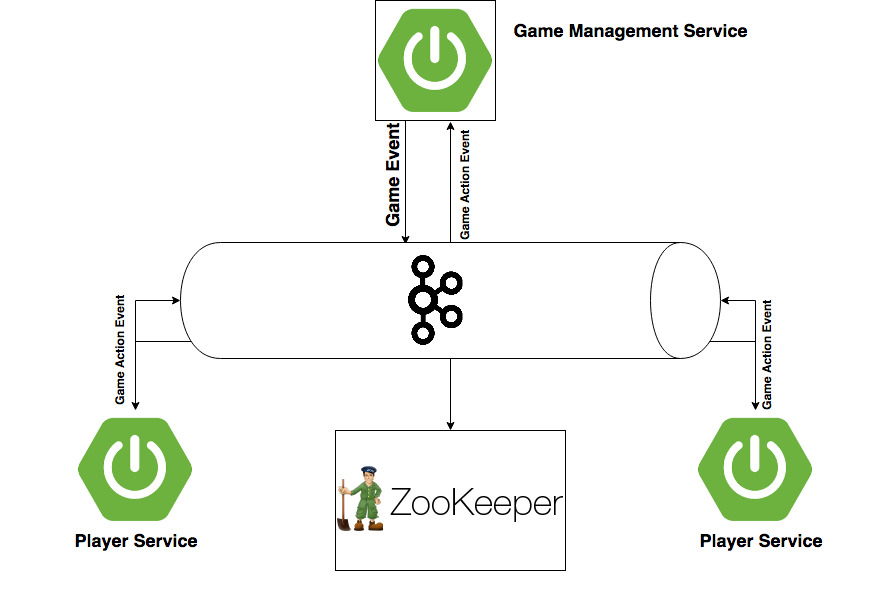
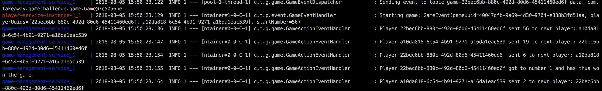

# Takeaway.com Coding Challenge

## Architecture
The architecture of the challenge looks, from a high level perspective, like in the picture below.

### Architecture components
 - <strong>Game Management Service:</strong> Like the name describes, it is responsible for managing the games that are being played and 
 the players of these games. It exposes REST API endpoints for these purposes. All data is persisted in a Postgres database
 
    - ``POST /api/player`` 
        - ``{
          	"name" : "Bogdan",
          	"uuid" : "22bec6bb-880c-492d-80d6-45411460ed6f"
          }``
    - ``GET /api/player/{uuid}``
    - ``DELETE /api/player{uuid}``
    - ``POST /api/game``
        - ``{
            	"uuid" : "10047dfb-9a69-4d30-9704-e888b3fd51aa",
            	"playerUuids" : ["22bec6bb-880c-492d-80d6-45411460ed6f", "a10da818-6c54-4b91-9271-a16da1eac539"],
            	"startNumber" : "56"
            }``

    Games require players in order to work, therefore players must be created before any attempt to start a game. If there
    is an attempt to start a game with UUIDs of players that do not exist, a ``400 Bad Request`` will be returned. Once a
    game is created it is automatically started and players start dividing numbers and sending events to each other.

- <strong>Kafka Broker:</strong> I went with a event driven architecture and chose Kafka as the message broker for sending
events to the Game Management Service and the Player Service instances.

- <strong>Apache Zookeeper: </strong> Zookeeper is a high performance coordination service that is used by our Kafka Broker
for forming cluster nodes. 

- <strong>Player Service:</strong> is responsible for receiving events from other instances of the Player Service and also
events from the Game Management Service to start a game. Player services must be started with two environment variable:
``player.game-action-event.topic=game-action-{uuid_of_created_player}`` and ``player.game-event.topic=game-{uuid_of_created_player}``.
 Both values of these environment variables must contain the UUID of the player created in the Game Management
 Service. Each instance of a Player Service will listen on Kafka topics with these names to receive and send events. As
 you can see, one topic is intended on storing only one kind of event.

### How a game is played
- A game must be created in the Game Management Service with at least two valid players
- Once the game is created, a scheduler will pick up the game instance and generate a ``GameEvent`` and send it to Kafka
on a topic that ``game-event-{uuid_of_starting_player}``.
- A Player Service instance will be listening on this topic and will receive the ``GameEvent`` and from it generate a new
``GameActionEvent`` and send it to another topic ``game-action-{uuid_of_next_player}``
- ``GameAction`` events will be received by Player Service instance and will add -1, 0 or 1 to he numeber, divide it by 3
and send a new ``GameActionEvent`` to the topic of the next player (``game-action-{uuid_of_next_player}``)
- A Player Service instance will also send the same ``GameActionEvent`` to a topic called ``game-monitoring`` that the
Game Management Service will listen on and print to standard output what actions have been taken and by which player.
- The Player Service instance that divides the received number by 3 and gets 1 as a result wins and will only send the
event to the ``game-monitoring`` topic so the Game Management Service can print the winner and mark the game as finished.

### Prerequisites for running this application
- docker
- docker-compose

#### How to run
- Run the ``build_services.sh`` script to build the two projects. This is required for creating the two jars needed in docker-compose
- Run ``docker-compose up`` in the root of this project where the ``docker-compose.yml`` is located.
- In a second terminal execute the ``init_scrip.sh`` script to get two players created and a game started
- Check the logs in the first terminal. You should see something like below:

- In the second terminal run ``docker-compose down`` to stop the application

### Tools and technologies used to this coding challenge
- Java 8
- Spring Boot
- Postgres
- Kafka + Zookeeper
- Docker

    
